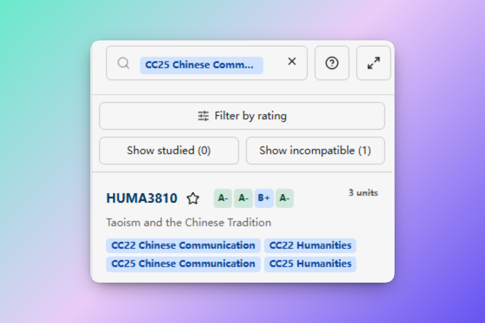
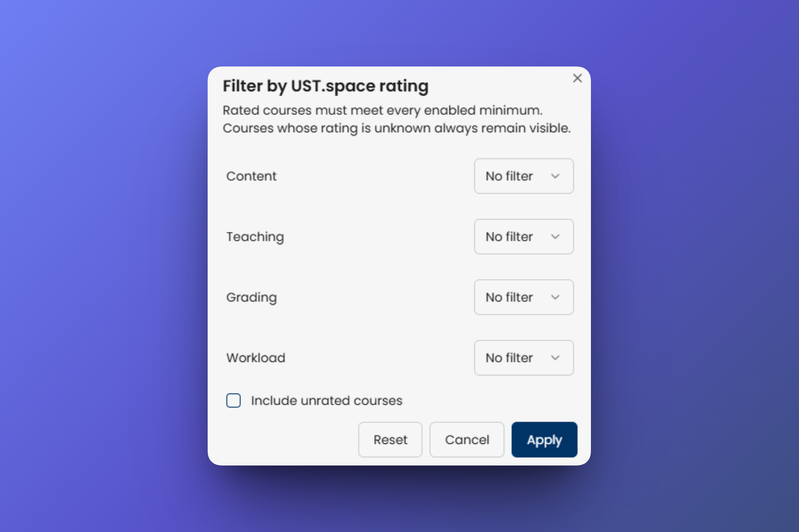

import installExtensionVideo from './vid/install-extension.mp4';

# Course Ratings for Planner

The **Course Ratings for Planner** Chrome extension retrieves aggregate course ratings from [UST.space](https://ust.space/) and displays them at [Timetable Planner](https://app.usthing.xyz/timetable-planner).

:::warning
This is a community-driven extension. No official support is provided for this extension. Install and use it at your own risk. Changes to Chrome, USThing, or UST.space may cause it to stop working without notice.
:::

The extension requires Chrome 102 or later and installs from a downloadable ZIP file as an unpacked extension.

## Set up the extension

### 1. Download and extract the ZIP

[Download the Course Ratings for Planner ZIP](https://drive.google.com/file/d/13hMwUr3K3sK1x1JVEqVn3CRW-_1LaxXw/view?usp=sharing)

:::warning 
Ratings displayed will be stored within your plan.
:::

After downloading:

1. Extract the ZIP file.
2. Move the extracted extension folder to a permanent location on your computer.

Do not delete or move this folder after loading it in Chrome. Chrome uses the extracted files to run the unpacked extension.

### 2. Load it in Chrome

1. Open `chrome://extensions`.
2. Turn on **Developer mode**.
3. Select **Load unpacked**.
4. Choose the extracted folder that contains `manifest.json`. Do not choose the ZIP file or the `dist` subfolder.
5. Confirm that **Course Ratings for Planner** is enabled.

The following video demonstrates the complete installation process:

<video
  aria-label="Installing the Course Ratings for Planner extension in Chrome"
  controls
  playsInline
  preload="metadata"
  src={installExtensionVideo}
  style={{width: '100%', height: 'auto'}}
/>

When a new extension build is available, download and extract the new ZIP, replace the files in your existing extension folder, select **Reload** on the extension card, and reload Timetable Planner.

### 3. Sign in and verify the connection

1. Sign in to [UST.space](https://ust.space/login).
2. Sign in to USThing and open [Timetable Planner](https://app.usthing.xyz/timetable-planner).
3. Reload the planner if it was already open when you enabled the extension.
4. Search for a course. Rating badges appear beside a course after its rating is retrieved.
## Filter courses by rating

1. Search for courses in Timetable Planner.
2. Select **Filter by rating** above the results.
3. Choose a minimum letter grade for any combination of **Content**, **Teaching**, **Grading**, and **Workload**.
4. Select **Include unrated courses** if courses confirmed to have no reviews should remain visible.
5. Select **Apply**.

A rated course must meet every enabled minimum. Courses whose rating has not been retrieved remain visible so a temporary extension or network problem does not hide possible results.

## Data and permissions

The extension requests access to `https://ust.space/*` so its background worker can retrieve course reviews using the UST.space session already active in Chrome. It does not request Chrome cookie permission.

Data retrieved is stored in your plan, and will be available in other devices when you sign in to USThing.