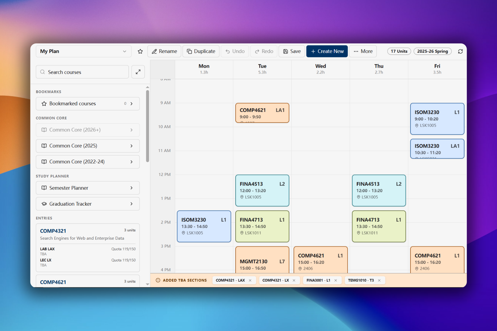
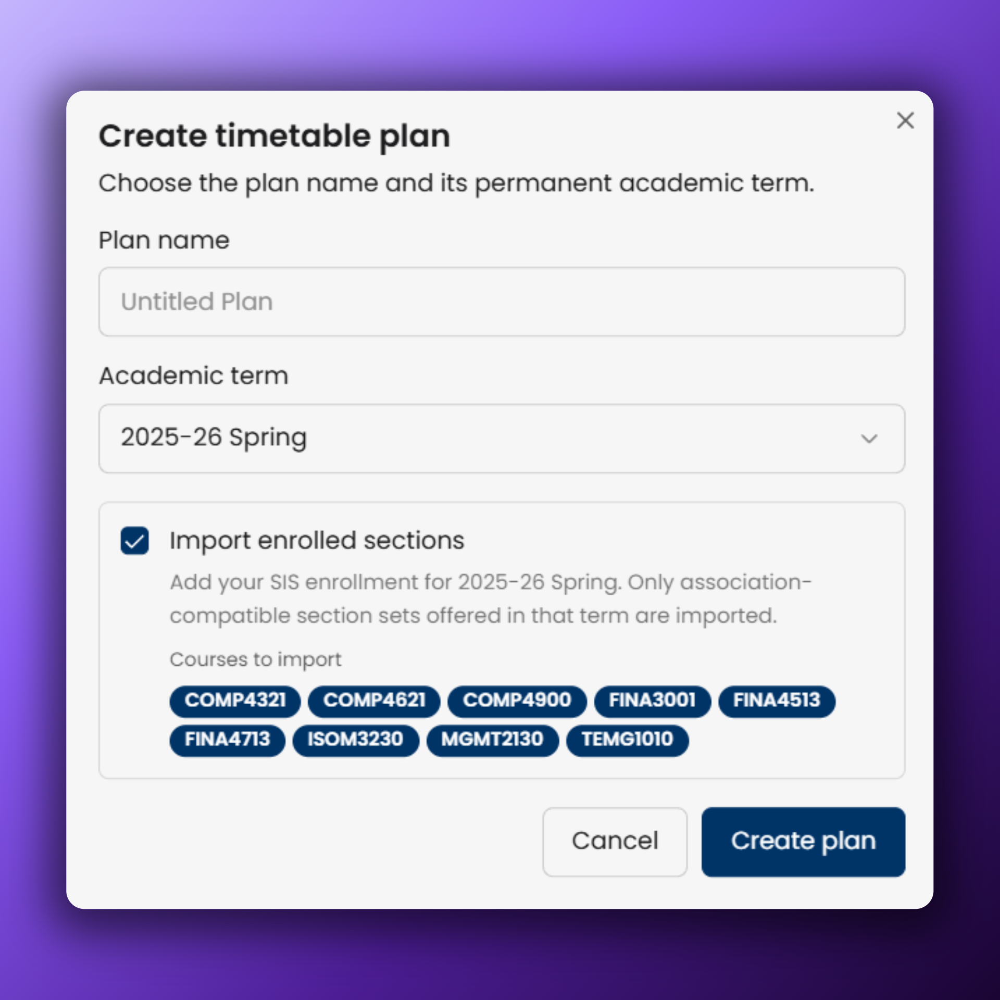

# Timetable Planner

The Timetable Planner helps you build an HKUST class schedule, compare compatible section combinations, and spot time conflicts before enrollment.

[Open Timetable Planner](https://app.usthing.xyz/timetable-planner)

:::info
The planner is a planning aid. Always confirm your final schedule, enrollment status, prerequisites, and section availability in SIS.
:::

## Create a plan

1. Open **Timetable Planner** in the Dashboard.
2. Select **Create plan**.
3. Enter a plan name and choose its academic term.
4. Keep **Import enrolled sections** selected if you want to start with your eligible SIS enrollment for that term.
5. Review the import preview, then select **Create plan**.

The academic term cannot be changed after the plan is created. Create another plan if you want to work with a different term.

## Add courses and sections

On a desktop, use the course browser beside the timetable. On a phone, select the floating **Browse courses** button.

1. [Search or filter for a course](/docs/dashboard/timetable-planner/search-and-filtering).
2. Open the course to view its description, requirements, and available lecture, tutorial, and lab sections.
3. Hover over or focus a section to preview it on the timetable.
4. Select a section to apply it. The planner also selects association-compatible sections when required.

Selected sections appear under **Entries** and on the timetable grid. Open a selected course to change its sections or remove the course.

### Understand timetable warnings

- Red sections overlap another selected section and require your attention.
- The warning below the grid reports when the timetable contains conflicts.
- Sections without a confirmed meeting time appear under **Added TBA Sections** instead of at a time on the grid.
- Hover over a section to see quota, waitlist, instructor, linked sections, and conflicts.

## Save and manage plans

Edits are saved automatically after a short pause. Select **Save** to save immediately.

The top toolbar also lets you:

- switch between plans;
- bookmark, rename, duplicate, or delete a plan;
- undo and redo section changes;
- create another plan;
- show or hide weekend columns; and
- reload course, enrollment, and Study Planner data.

The unit total is calculated once per course, even when the course has multiple class components.

## Next steps

- [Search and filtering](/docs/dashboard/timetable-planner/search-and-filtering)
- [Study Planner integration](/docs/dashboard/timetable-planner/study-planner-integration)
- [Course Ratings for Planner](/docs/dashboard/timetable-planner/course-ratings-extension)
