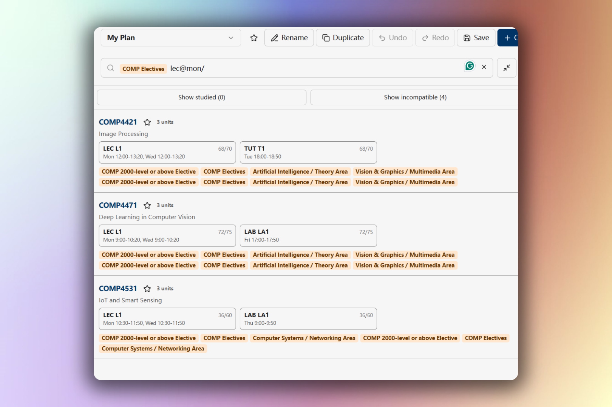

# Search and filtering

Use the course browser to find offered courses by code or title, narrow them to a planning source, and keep only section combinations that fit your timetable.

Search starts after you enter at least two characters. Matching is case-insensitive.

## Basic search

Enter a course code, department, number, or words from a course title.

| Search | Matches |
| --- | --- |
| `COMP` | Courses whose code or title contains COMP |
| `COMP 2011` | Courses matching both COMP and 2011 |
| `"machine learning"` | The complete phrase *machine learning* |
| `COMP OR MATH` | Courses matching either COMP or MATH |
| `(COMP OR MATH) 2` | COMP or MATH matches that also contain 2 |

Spaces work like `AND`. Explicit `AND` and `OR` are also supported, `AND` is evaluated before `OR`, and parentheses change the grouping. `NOT` is not supported.

Select **Clear search** to remove the complete expression. Source filters appear as colored chips and can be removed with Backspace.

## Filter by a course source

When the search box is empty, the course browser offers these sources:

- **Bookmarked courses** shows courses bookmarked in the current timetable plan.
- **Common Core** lets you choose a curriculum and area.
- **Semester Planner** shows courses assigned to a planned term.
- **Graduation Tracker** shows planned courses or courses that satisfy a requirement or area.

Source chips also appear on matching courses. Select a chip to add that source to the current search. For example, adding a Common Core chip to `HUMA` keeps only HUMA courses in that Common Core area.

You can type a few common source expressions directly:

| Expression | Meaning |
| --- | --- |
| `bookmarked` | Courses bookmarked in the current timetable plan |
| `CC22:SA` | CC22 Social Analysis courses |
| `y2f` | Courses in Year 2 Fall across your Semester Planner plans |
| `gt:planned` | Planned courses across your Graduation Tracker plans |

Plan-specific Semester Planner and Graduation Tracker expressions contain internal plan and requirement IDs. Use the source picker instead of typing those expressions manually.

## Filter by class time

Class-time filters evaluate compatible lecture (`LEC`), tutorial (`TUT`), or lab (`LAB`) combinations.

| Search | Meaning |
| --- | --- |
| `COMP LEC@Tue,Thu` | COMP courses with a lecture meeting on exactly Tuesday and Thursday |
| `COMP LAB@Fri0900-1200` | COMP courses whose Friday lab meetings fit within 09:00–12:00 |
| `COMP TUT?@Fri0900-1200` | Apply the Friday window when a tutorial exists; also allow courses without tutorials |
| `COMP LEC@Tue/` | Require Tuesday and allow the lecture to meet on additional days |
| `COMP (LEC@Tue OR LEC@Fri/)` | COMP courses with either of the two lecture patterns |

Use 24-hour times in `HHMM` format. A trailing `/` allows meeting days in addition to the days you list. A `?` after the component type makes that component optional.

Every `OR` branch containing a class-time filter must also contain a course or source filter. A class-time filter cannot be used as a stand-alone catalog search.

## Hide studied or incompatible results

Two controls appear above the search results:

- **Hide studied** removes courses identified in your academic record. The count applies to the current search results.
- **Hide incompatible** removes courses that have no conflict-free section combination with the current timetable.

Select either control again to show the hidden results.

On desktop, select **Expand sidebar** beside the search box to list individual compatible section combinations. In expanded mode, **Hide incompatible** removes conflicting combinations rather than hiding an entire course when at least one compatible combination remains. Hover over a combination to preview it, then select it to apply all of its linked sections.

## Why a result may be unavailable

Study Planner and Graduation Tracker sources can reference a course that is not offered in the timetable plan's selected academic term. The result remains visible with **Not offered**, but it cannot be added to the timetable.

Search messages explain invalid expressions, unavailable source filters, and cases where all matching results are hidden.
